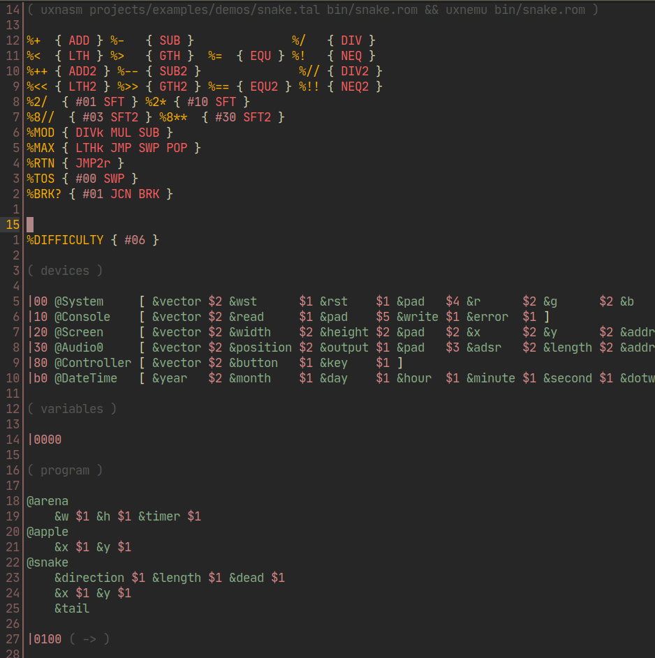

# Kakoune UXNTal Syntax Highlighting

Syntax highlighter for [uxntal](https://wiki.xxiivv.com/site/uxntal.html) code in [Kakoune](kakoune.org). Sourcing this `.kak` file in your `kakrc` should enable syntax highlighting on any `.tal` file you open.

## Usage

## Install with [plug.kak](https://github.com/andreyorst/plug.kak)

- Write the following to your kakrc
```
plug "https://git.sr.ht/~athorp96/uxntal.kak"
```
- Open a new kakoune session, and run `:plug-install`
- Move to the line starting with `https://git.sr.ht/~athorp96/uxntal.kak` and press `I`
- Now in sessions of kakoune creating a buffer or opening a file with extension `.tal` will enable this syntax highlighting

### Manually Install

- Clone this repo into `$kakrc_directory/plugins`
- Include the following line in your Kakrc:
```
source "%val{config}/plugins/uxntal.kak/rc/filetype/tal.kak"
```
- Now in sessions of kakoune creating a buffer or opening a file with extension `.tal` will enable this syntax highlighting


## Example syntax colors using the colorscheme Gruvbox

